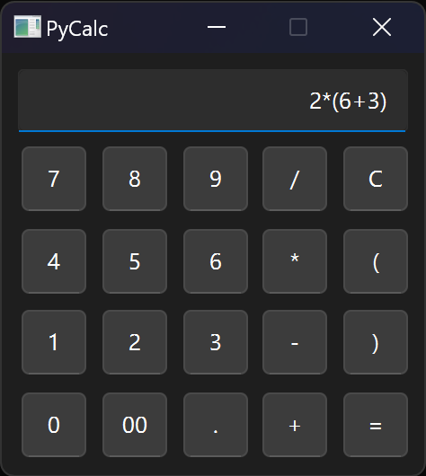

# PyCalc

> GUI calculator via PyQt6



A functional GUI calculator built with PyQt6,
following the Real Python tutorial [Building a GUI Desktop Calculator](./notes.md).

## Installation

### Windows

```
python -m venv <venv_name>
<venv_name>\Scripts\activate
python -m pip install -r requirements.txt
```

## Usage

```
python pycalc.py
```

## Release History

* v1.0

## License

This project is distributed under MIT license.
See [LICENSE](./LICENSE) for more information.
